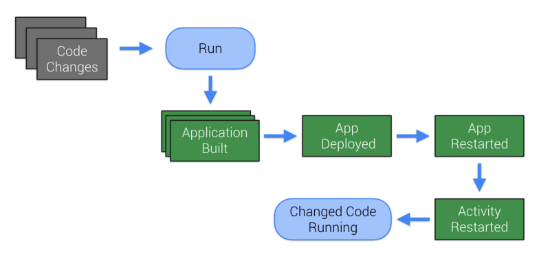
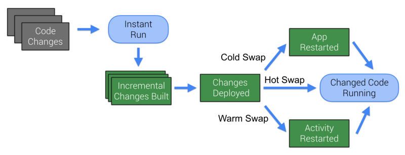
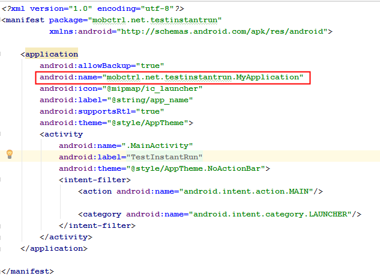
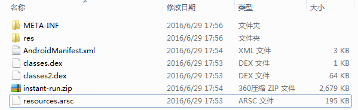
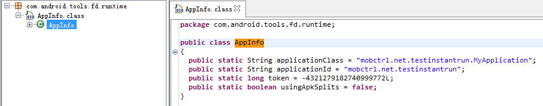
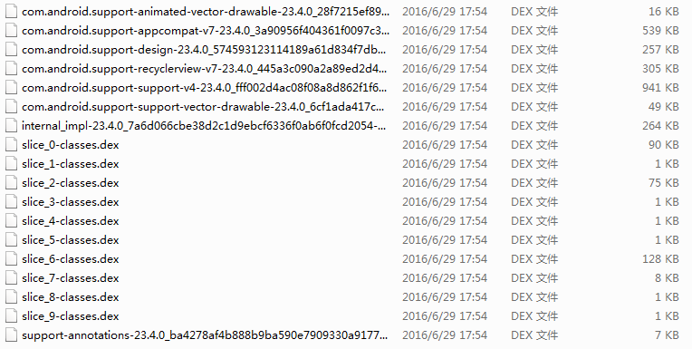
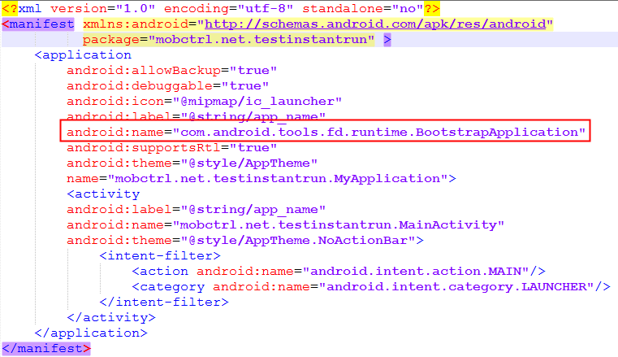
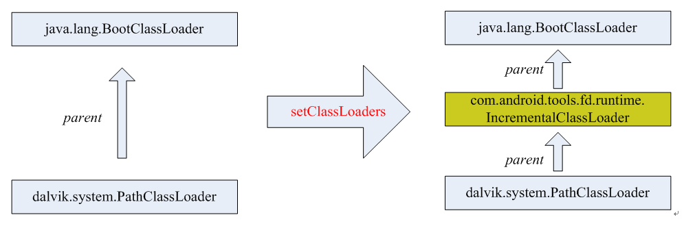

#深度理解Android InstantRun原理以及源码分析

@Author 莫川
##Instant Run官方介绍
简单介绍一下Instant Run,它是Android Studio2.0以后新增的一个运行机制，能够显著减少你第二次及以后的构建和部署时间。简单通俗的解释就是，当你在Android Studio中改了你的代码，Instant Run可以很快的让你看到你修改的效果。而在没有Instant Run之前，你的一个小小的修改，都肯能需要几十秒甚至更长的等待才能看到修改后的效果。
###传统的代码修改及编译部署流程
<br>

*构建整个apk → 部署app → app重启 → 重启Activity*<br>
而Instant Run则需要更少的时间。<br>
###Instant Run编译和部署流程<br>
<br>
*只构建修改的部分 → 部署修改的dex或资源 → 热部署，温部署，冷部署*<br>

####热部署
Incremental code changes are applied and reflected in the app without needing to relaunch the app or even restart the current Activity. Can be used for most simple changes within method implementations.
方法内的简单修改，无需重启app和Activity
####温部署
The Activity needs to be restarted before changes can be seen and used. Typically required for changes to resources.
app无需重启，但是activity需要重启，比如资源的修改。
####冷部署
The app is restarted (but still not reinstalled). Required for any structural changes such as to inheritance or method signatures.
app需要重启，比如继承关系的改变或方法的签名变化等。

上述说这么多概念，估计大家对Instant Run应该有了大体的认知了。那么它的实现原理是什么呢？其实，在没有看案例之前，我基本上可以猜测到Instant Run的思路，基于目前比较火的插件化框架，是比较容易理解Instant Run的。但Instant Run毕竟是Google官方的工具，具有很好的借鉴意义。
##Demo案例
新建一个简单的android studio项目，新建自己的MyApplication，在AndroidManifest文件中设置：<br> 
<br>
首先，我们先反编译一下APK的构成：
使用的工具：d2j-dex2jar 和jd-gui<br>
<br>
里面有2个dex文件和一个instant-run.zip文件。首先分别看一下两个dex文件的源码：<br>
classes.dex的反编译之后的源码：<br>
<br>
里面只有一个AppInfo，保存了app的基本信息，主要包含了包名和applicationClass。<br>
classes2.dex反编译之后的源码：<br>
<br>
我们赫然发现，两个dex中竟然没有一句我们自己写的代码？？那么代码在哪里呢？你可能猜到，app真正的业务dex在instant-run.zip中。解压instant-run.zip之后，如下图所示：<br>
<br>
反编译之后，我们会发现，我们真正的业务代码都在这里。<br>
另外，我们再decode看一下AndroidManifest文件<br>
<br>
//TODO
我们发现，我们的application也被替换了，替换成了com.android.tools.fd.runtime.BootstrapApplication

看到这里，那么大体的思路，可以猜到：
1.Instant-Run代码作为一个宿主程序，将app作为资源dex加载起来，和插件化一个思路
2.那么InstantRun是怎么把业务代码运行起来的呢？
##InstantRun启动app
首先BootstrapApplication分析，按照执行顺序，依次分析attachBaseContext和onCreate方法。
####1.attachBaseContext方法
```java
    
    ...
    protected void attachBaseContext(Context context) {
		if (!AppInfo.usingApkSplits) {
			String apkFile = context.getApplicationInfo().sourceDir;
			long apkModified = apkFile != null ? new File(apkFile)
					.lastModified() : 0L;
			createResources(apkModified);
			setupClassLoaders(context, context.getCacheDir().getPath(),
					apkModified);
		}
		createRealApplication();

		super.attachBaseContext(context);
		if (this.realApplication != null) {
			try {
				Method attachBaseContext = ContextWrapper.class
						.getDeclaredMethod("attachBaseContext",
								new Class[] { Context.class });

				attachBaseContext.setAccessible(true);
				attachBaseContext.invoke(this.realApplication,
						new Object[] { context });
			} catch (Exception e) {
				throw new IllegalStateException(e);
			}
		}
	}
    ...
```

我们依次需要关注的方法有：
createResources → setupClassLoaders → createRealApplication → 调用realApplication的attachBaseContext方法

#####1.1.createResources
首先看createResources方法：

```java 

     private void createResources(long apkModified) {
		FileManager.checkInbox();

		File file = FileManager.getExternalResourceFile();
		this.externalResourcePath = (file != null ? file.getPath() : null);
		if (Log.isLoggable("InstantRun", 2)) {
			Log.v("InstantRun", "Resource override is "
					+ this.externalResourcePath);
		}
		if (file != null) {
			try {
				long resourceModified = file.lastModified();
				if (Log.isLoggable("InstantRun", 2)) {
					Log.v("InstantRun", "Resource patch last modified: "
							+ resourceModified);
					Log.v("InstantRun", "APK last modified: " + apkModified
							+ " "
							+ (apkModified > resourceModified ? ">" : "<")
							+ " resource patch");
				}
				if ((apkModified == 0L) || (resourceModified <= apkModified)) {
					if (Log.isLoggable("InstantRun", 2)) {
						Log.v("InstantRun",
								"Ignoring resource file, older than APK");
					}
					this.externalResourcePath = null;
				}
			} catch (Throwable t) {
				Log.e("InstantRun", "Failed to check patch timestamps", t);
			}
		}
	}
```

该方法主要是判断资源resource.ap_是否改变，然后保存resource.ap_的路径到externalResourcePath中

#####1.2.setupClassLoaders

```java

    private static void setupClassLoaders(Context context, String codeCacheDir,
			long apkModified) {
		List<String> dexList = FileManager.getDexList(context, apkModified);

		Class<Server> server = Server.class;
		Class<MonkeyPatcher> patcher = MonkeyPatcher.class;
		if (!dexList.isEmpty()) {
			if (Log.isLoggable("InstantRun", 2)) {
				Log.v("InstantRun", "Bootstrapping class loader with dex list "
						+ join('\n', dexList));
			}
			ClassLoader classLoader = BootstrapApplication.class
					.getClassLoader();
			String nativeLibraryPath;
			try {
				nativeLibraryPath = (String) classLoader.getClass()
						.getMethod("getLdLibraryPath", new Class[0])
						.invoke(classLoader, new Object[0]);
				if (Log.isLoggable("InstantRun", 2)) {
					Log.v("InstantRun", "Native library path: "
							+ nativeLibraryPath);
				}
			} catch (Throwable t) {
				Log.e("InstantRun", "Failed to determine native library path "
						+ t.getMessage());
				nativeLibraryPath = FileManager.getNativeLibraryFolder()
						.getPath();
			}
			IncrementalClassLoader.inject(classLoader, nativeLibraryPath,
					codeCacheDir, dexList);
		}
	}

```

继续看IncrementalClassLoader.inject方法：
IncrementalClassLoader的源码如下：
```java

    public class IncrementalClassLoader extends ClassLoader {
	public static final boolean DEBUG_CLASS_LOADING = false;
	private final DelegateClassLoader delegateClassLoader;

	public IncrementalClassLoader(ClassLoader original,
			String nativeLibraryPath, String codeCacheDir, List<String> dexes) {
		super(original.getParent());

		this.delegateClassLoader = createDelegateClassLoader(nativeLibraryPath,
				codeCacheDir, dexes, original);
	}

	public Class<?> findClass(String className) throws ClassNotFoundException {
		try {
			return this.delegateClassLoader.findClass(className);
		} catch (ClassNotFoundException e) {
			throw e;
		}
	}

	private static class DelegateClassLoader extends BaseDexClassLoader {

		private DelegateClassLoader(String dexPath, File optimizedDirectory,
				String libraryPath, ClassLoader parent) {
			super(dexPath, optimizedDirectory, libraryPath, parent);
		}

		public Class<?> findClass(String name) throws ClassNotFoundException {
			try {
				return super.findClass(name);
			} catch (ClassNotFoundException e) {
				throw e;
			}
		}
	}

	private static DelegateClassLoader createDelegateClassLoader(
			String nativeLibraryPath, String codeCacheDir, List<String> dexes,
			ClassLoader original) {
		String pathBuilder = createDexPath(dexes);
		return new DelegateClassLoader(pathBuilder, new File(codeCacheDir),
				nativeLibraryPath, original);
	}

	private static String createDexPath(List<String> dexes) {
		StringBuilder pathBuilder = new StringBuilder();
		boolean first = true;
		for (String dex : dexes) {
			if (first) {
				first = false;
			} else {
				pathBuilder.append(File.pathSeparator);
			}
			pathBuilder.append(dex);
		}
		if (Log.isLoggable("InstantRun", 2)) {
			Log.v("InstantRun", "Incremental dex path is "
					+ BootstrapApplication.join('\n', dexes));
		}
		return pathBuilder.toString();
	}

	private static void setParent(ClassLoader classLoader, ClassLoader newParent) {
		try {
			Field parent = ClassLoader.class.getDeclaredField("parent");
			parent.setAccessible(true);
			parent.set(classLoader, newParent);
		} catch (IllegalArgumentException e) {
			throw new RuntimeException(e);
		} catch (IllegalAccessException e) {
			throw new RuntimeException(e);
		} catch (NoSuchFieldException e) {
			throw new RuntimeException(e);
		}
	}

	public static ClassLoader inject(ClassLoader classLoader,
			String nativeLibraryPath, String codeCacheDir, List<String> dexes) {
		IncrementalClassLoader incrementalClassLoader = new IncrementalClassLoader(
				classLoader, nativeLibraryPath, codeCacheDir, dexes);

		setParent(classLoader, incrementalClassLoader);

		return incrementalClassLoader;
	}
    }
```

inject方法是用来设置classloader的父子顺序的，使用IncrementalClassLoader来加载dex。由于ClassLoader的双亲委托模式，也就是委托父类加载类，父类中找不到再在本ClassLoader中查找。
调用之后的效果如下图所示：<br>

我们可以在MyApplication中，用代码验证一下<br>
```java
     
     @Override
    public void onCreate() {
        super.onCreate();
        try{
            Log.d(TAG,"###onCreate in myApplication");
            String classLoaderName = getClassLoader().getClass().getName();
            Log.d(TAG,"###onCreate in myApplication classLoaderName = "+classLoaderName);
            String parentClassLoaderName = getClassLoader().getParent().getClass().getName();
            Log.d(TAG,"###onCreate in myApplication parentClassLoaderName = "+parentClassLoaderName);
            String pParentClassLoaderName = getClassLoader().getParent().getParent().getClass().getName();
            Log.d(TAG,"###onCreate in myApplication pParentClassLoaderName = "+pParentClassLoaderName);
        }catch (Exception e){
            e.printStackTrace();
        }
    }
```

运行结果：
```txt
     ...
     06-30 10:43:42.475 27307-27307/mobctrl.net.testinstantrun D/MyApplication: ###onCreate in myApplication classLoaderName = dalvik.system.PathClassLoader
06-30 10:43:42.475 27307-27307/mobctrl.net.testinstantrun D/MyApplication: ###onCreate in myApplication parentClassLoaderName = com.android.tools.fd.runtime.IncrementalClassLoader
06-30 10:43:42.475 27307-27307/mobctrl.net.testinstantrun D/MyApplication: ###onCreate in myApplication pParentClassLoaderName = java.lang.BootClassLoader
```

由此，我们已经知道了，当前PathClassLoader委托IncrementalClassLoader加载dex。继续回到BootstrapApplication的attachBaseContext方法继续分析。
#####1.3.createRealApplication

```java
    
    private void createRealApplication() {
		if (AppInfo.applicationClass != null) {
			if (Log.isLoggable("InstantRun", 2)) {
				Log.v("InstantRun",
						"About to create real application of class name = "
								+ AppInfo.applicationClass);
			}
			try {
				Class<? extends Application> realClass = (Class<? extends Application>) Class
						.forName(AppInfo.applicationClass);
				if (Log.isLoggable("InstantRun", 2)) {
					Log.v("InstantRun",
							"Created delegate app class successfully : "
									+ realClass + " with class loader "
									+ realClass.getClassLoader());
				}
				Constructor<? extends Application> constructor = realClass
						.getConstructor(new Class[0]);
				this.realApplication = ((Application) constructor
						.newInstance(new Object[0]));
				if (Log.isLoggable("InstantRun", 2)) {
					Log.v("InstantRun",
							"Created real app instance successfully :"
									+ this.realApplication);
				}
			} catch (Exception e) {
				throw new IllegalStateException(e);
			}
		} else {
			this.realApplication = new Application();
		}
	}
```
该方法就是用classes.dex中的AppInfo类的applicationClass常量中保存的app真实的application。由上面的反编译截图可以知道，demo中的applicationClass就是mobctrl.net.testinstantrun.MyApplication。通过反射的方式，创建真是的realApplication。

#####1.4.调用realApplication的attachBaseContext方法
代理realApplication的生命周期，通过反射调用realApplication的attachBaseContext方法，以当前的Context为参数。<br>
attachBaseContext方法执行结束之后，我们继续往下看，到BootstrapApplication的onCreate方法
###2.onCreate
源码如下：
```java

     public void onCreate() {
		if (!AppInfo.usingApkSplits) {
			MonkeyPatcher.monkeyPatchApplication(this, this,
					this.realApplication, this.externalResourcePath);

			MonkeyPatcher.monkeyPatchExistingResources(this,
					this.externalResourcePath, null);
		} else {
			MonkeyPatcher.monkeyPatchApplication(this, this,
					this.realApplication, null);
		}
		super.onCreate();
		if (AppInfo.applicationId != null) {
			try {
				boolean foundPackage = false;
				int pid = Process.myPid();
				ActivityManager manager = (ActivityManager) getSystemService("activity");

				List<ActivityManager.RunningAppProcessInfo> processes = manager
						.getRunningAppProcesses();
				boolean startServer = false;
				if ((processes != null) && (processes.size() > 1)) {
					for (ActivityManager.RunningAppProcessInfo processInfo : processes) {
						if (AppInfo.applicationId
								.equals(processInfo.processName)) {
							foundPackage = true;
							if (processInfo.pid == pid) {
								startServer = true;
								break;
							}
						}
					}
					if ((!startServer) && (!foundPackage)) {
						startServer = true;
						if (Log.isLoggable("InstantRun", 2)) {
							Log.v("InstantRun",
									"Multiprocess but didn't find process with package: starting server anyway");
						}
					}
				} else {
					startServer = true;
				}
				if (startServer) {
					Server.create(AppInfo.applicationId, this);
				}
			} catch (Throwable t) {
				if (Log.isLoggable("InstantRun", 2)) {
					Log.v("InstantRun", "Failed during multi process check", t);
				}
				Server.create(AppInfo.applicationId, this);
			}
		}
		if (this.realApplication != null) {
			this.realApplication.onCreate();
		}
	}
```

我们依次需要关注的方法有：
monkeyPatchApplication → monkeyPatchExistingResources → Server启动 → 调用realApplication的onCreate方法

####2.1 monkeyPatchApplication
该方法的目的可以总结为：替换所有当前app的application为realApplication。<br>
```java

    public static void monkeyPatchApplication(Context context,
			Application bootstrap, Application realApplication,
			String externalResourceFile) {
		try {
			Class<?> activityThread = Class
					.forName("android.app.ActivityThread");
			Object currentActivityThread = getActivityThread(context,
					activityThread);

			Field mInitialApplication = activityThread
					.getDeclaredField("mInitialApplication");
			mInitialApplication.setAccessible(true);
			Application initialApplication = (Application) mInitialApplication
					.get(currentActivityThread);
			if ((realApplication != null) && (initialApplication == bootstrap)) {
				mInitialApplication.set(currentActivityThread, realApplication);
			}
			if (realApplication != null) {
				Field mAllApplications = activityThread
						.getDeclaredField("mAllApplications");
				mAllApplications.setAccessible(true);
				List<Application> allApplications = (List<Application>) mAllApplications
						.get(currentActivityThread);
				for (int i = 0; i < allApplications.size(); i++) {
					if (allApplications.get(i) == bootstrap) {
						allApplications.set(i, realApplication);
					}
				}
			}
			Class<?> loadedApkClass;
			try {
				loadedApkClass = Class.forName("android.app.LoadedApk");
			} catch (ClassNotFoundException e) {
				loadedApkClass = Class
						.forName("android.app.ActivityThread$PackageInfo");
			}
			Field mApplication = loadedApkClass
					.getDeclaredField("mApplication");
			mApplication.setAccessible(true);
			Field mResDir = loadedApkClass.getDeclaredField("mResDir");
			mResDir.setAccessible(true);

			Field mLoadedApk = null;
			try {
				mLoadedApk = Application.class.getDeclaredField("mLoadedApk");
			} catch (NoSuchFieldException e) {
			}
			for (String fieldName : new String[] { "mPackages",
					"mResourcePackages" }) {
				Field field = activityThread.getDeclaredField(fieldName);
				field.setAccessible(true);
				Object value = field.get(currentActivityThread);
				for (Map.Entry<String, WeakReference<?>> entry : ((Map<String, WeakReference<?>>) value)
						.entrySet()) {
					Object loadedApk = ((WeakReference) entry.getValue()).get();
					if (loadedApk != null) {
						if (mApplication.get(loadedApk) == bootstrap) {
							if (realApplication != null) {
								mApplication.set(loadedApk, realApplication);
							}
							if (externalResourceFile != null) {
								mResDir.set(loadedApk, externalResourceFile);
							}
							if ((realApplication != null)
									&& (mLoadedApk != null)) {
								mLoadedApk.set(realApplication, loadedApk);
							}
						}
					}
				}
			}
		} catch (Throwable e) {
			throw new IllegalStateException(e);
		}
	}
```

具体做的事情可以总结为：<br>
######1.替换ActivityThread的mInitialApplication为realApplication
######2.替换mAllApplications 中所有的Application为realApplication
######3.替换ActivityThread的mPackages,mResourcePackages中的mLoaderApk中的application为realApplication。

####2.2 monkeyPatchExistingResources
替换所有当前app的mAssets为newAssetManager。<br>
```java

    public static void monkeyPatchExistingResources(Context context,
			String externalResourceFile, Collection<Activity> activities) {
		if (externalResourceFile == null) {
			return;
		}
		try {
			AssetManager newAssetManager = (AssetManager) AssetManager.class
					.getConstructor(new Class[0]).newInstance(new Object[0]);
			Method mAddAssetPath = AssetManager.class.getDeclaredMethod(
					"addAssetPath", new Class[] { String.class });
			mAddAssetPath.setAccessible(true);
			if (((Integer) mAddAssetPath.invoke(newAssetManager,
					new Object[] { externalResourceFile })).intValue() == 0) {
				throw new IllegalStateException(
						"Could not create new AssetManager");
			}
			Method mEnsureStringBlocks = AssetManager.class.getDeclaredMethod(
					"ensureStringBlocks", new Class[0]);
			mEnsureStringBlocks.setAccessible(true);
			mEnsureStringBlocks.invoke(newAssetManager, new Object[0]);
			if (activities != null) {
				for (Activity activity : activities) {
					Resources resources = activity.getResources();
					try {
						Field mAssets = Resources.class
								.getDeclaredField("mAssets");
						mAssets.setAccessible(true);
						mAssets.set(resources, newAssetManager);
					} catch (Throwable ignore) {
						Field mResourcesImpl = Resources.class
								.getDeclaredField("mResourcesImpl");
						mResourcesImpl.setAccessible(true);
						Object resourceImpl = mResourcesImpl.get(resources);
						Field implAssets = resourceImpl.getClass()
								.getDeclaredField("mAssets");
						implAssets.setAccessible(true);
						implAssets.set(resourceImpl, newAssetManager);
					}
					Resources.Theme theme = activity.getTheme();
					try {
						try {
							Field ma = Resources.Theme.class
									.getDeclaredField("mAssets");
							ma.setAccessible(true);
							ma.set(theme, newAssetManager);
						} catch (NoSuchFieldException ignore) {
							Field themeField = Resources.Theme.class
									.getDeclaredField("mThemeImpl");
							themeField.setAccessible(true);
							Object impl = themeField.get(theme);
							Field ma = impl.getClass().getDeclaredField(
									"mAssets");
							ma.setAccessible(true);
							ma.set(impl, newAssetManager);
						}
						Field mt = ContextThemeWrapper.class
								.getDeclaredField("mTheme");
						mt.setAccessible(true);
						mt.set(activity, null);
						Method mtm = ContextThemeWrapper.class
								.getDeclaredMethod("initializeTheme",
										new Class[0]);
						mtm.setAccessible(true);
						mtm.invoke(activity, new Object[0]);

						Method mCreateTheme = AssetManager.class
								.getDeclaredMethod("createTheme", new Class[0]);
						mCreateTheme.setAccessible(true);
						Object internalTheme = mCreateTheme.invoke(
								newAssetManager, new Object[0]);
						Field mTheme = Resources.Theme.class
								.getDeclaredField("mTheme");
						mTheme.setAccessible(true);
						mTheme.set(theme, internalTheme);
					} catch (Throwable e) {
						Log.e("InstantRun",
								"Failed to update existing theme for activity "
										+ activity, e);
					}
					pruneResourceCaches(resources);
				}
			}
			Collection<WeakReference<Resources>> references;
			if (Build.VERSION.SDK_INT >= 19) {
				Class<?> resourcesManagerClass = Class
						.forName("android.app.ResourcesManager");
				Method mGetInstance = resourcesManagerClass.getDeclaredMethod(
						"getInstance", new Class[0]);
				mGetInstance.setAccessible(true);
				Object resourcesManager = mGetInstance.invoke(null,
						new Object[0]);
				try {
					Field fMActiveResources = resourcesManagerClass
							.getDeclaredField("mActiveResources");
					fMActiveResources.setAccessible(true);

					ArrayMap<?, WeakReference<Resources>> arrayMap = (ArrayMap) fMActiveResources
							.get(resourcesManager);
					references = arrayMap.values();
				} catch (NoSuchFieldException ignore) {
					Field mResourceReferences = resourcesManagerClass
							.getDeclaredField("mResourceReferences");
					mResourceReferences.setAccessible(true);

					references = (Collection) mResourceReferences
							.get(resourcesManager);
				}
			} else {
				Class<?> activityThread = Class
						.forName("android.app.ActivityThread");
				Field fMActiveResources = activityThread
						.getDeclaredField("mActiveResources");
				fMActiveResources.setAccessible(true);
				Object thread = getActivityThread(context, activityThread);

				HashMap<?, WeakReference<Resources>> map = (HashMap) fMActiveResources
						.get(thread);

				references = map.values();
			}
			for (WeakReference<Resources> wr : references) {
				Resources resources = (Resources) wr.get();
				if (resources != null) {
					try {
						Field mAssets = Resources.class
								.getDeclaredField("mAssets");
						mAssets.setAccessible(true);
						mAssets.set(resources, newAssetManager);
					} catch (Throwable ignore) {
						Field mResourcesImpl = Resources.class
								.getDeclaredField("mResourcesImpl");
						mResourcesImpl.setAccessible(true);
						Object resourceImpl = mResourcesImpl.get(resources);
						Field implAssets = resourceImpl.getClass()
								.getDeclaredField("mAssets");
						implAssets.setAccessible(true);
						implAssets.set(resourceImpl, newAssetManager);
					}
					resources.updateConfiguration(resources.getConfiguration(),
							resources.getDisplayMetrics());
				}
			}
		} catch (Throwable e) {
			throw new IllegalStateException(e);
		}
	}
```


改方法的目的总结为：<br>
1.如果resource.ap_文件有改变，那么新建一个AssetManager对象newAssetManager，然后用newAssetManager对象替换所有当前Resource、Resource.Theme的mAssets成员变量。
2.如果当前的已经有Activity启动了，还需要替换所有Activity中mAssets成员变量

####2.3 Server启动
判断Server是否已经启动，如果没有启动，则启动Server

####2.4 调用realApplication的onCreate方法
和1.4的目的一样，代理realApplication的生命周期。<br>
至此，我们的app就启动起来了。下一步就要分析，Server启动之后，到底是如何进行热部署、温部署和冷部署了。

###3.Server负责的热部署、温部署和冷部署
首先重点关注一下Server的内部类SocketServerReplyThread

####3.1 SocketServerReplyThread
```java
   
    ...
    private class SocketServerReplyThread extends Thread {
		private final LocalSocket mSocket;

		SocketServerReplyThread(LocalSocket socket) {
			this.mSocket = socket;
		}

		public void run() {
			try {
				DataInputStream input = new DataInputStream(
						this.mSocket.getInputStream());
				DataOutputStream output = new DataOutputStream(
						this.mSocket.getOutputStream());
				try {
					handle(input, output);
				} finally {
					try {
						input.close();
					} catch (IOException ignore) {
					}
					try {
						output.close();
					} catch (IOException ignore) {
					}
				}
				return;
			} catch (IOException e) {
				if (Log.isLoggable("InstantRun", 2)) {
					Log.v("InstantRun", "Fatal error receiving messages", e);
				}
			}
		}

		private void handle(DataInputStream input, DataOutputStream output)
				throws IOException {
			long magic = input.readLong();
			if (magic != 890269988L) {
				Log.w("InstantRun",
						"Unrecognized header format " + Long.toHexString(magic));

				return;
			}
			int version = input.readInt();

			output.writeInt(4);
			if (version != 4) {
				Log.w("InstantRun",
						"Mismatched protocol versions; app is using version 4 and tool is using version "
								+ version);
			} else {
				int message;
				for (;;) {
					message = input.readInt();
					switch (message) {
					case 7:
						if (Log.isLoggable("InstantRun", 2)) {
							Log.v("InstantRun", "Received EOF from the IDE");
						}
						return;
					case 2:
						boolean active = Restarter
								.getForegroundActivity(Server.this.mApplication) != null;
						output.writeBoolean(active);
						if (Log.isLoggable("InstantRun", 2)) {
							Log.v("InstantRun",
									"Received Ping message from the IDE; returned active = "
											+ active);
						}
						break;
					case 3:
						String path = input.readUTF();
						long size = FileManager.getFileSize(path);
						output.writeLong(size);
						if (Log.isLoggable("InstantRun", 2)) {
							Log.v("InstantRun", "Received path-exists(" + path
									+ ") from the " + "IDE; returned size="
									+ size);
						}
						break;
					case 4:
						long begin = System.currentTimeMillis();
						path = input.readUTF();
						byte[] checksum = FileManager.getCheckSum(path);
						if (checksum != null) {
							output.writeInt(checksum.length);
							output.write(checksum);
							if (Log.isLoggable("InstantRun", 2)) {
								long end = System.currentTimeMillis();
								String hash = new BigInteger(1, checksum)
										.toString(16);
								Log.v("InstantRun", "Received checksum(" + path
										+ ") from the " + "IDE: took "
										+ (end - begin) + "ms to compute "
										+ hash);
							}
						} else {
							output.writeInt(0);
							if (Log.isLoggable("InstantRun", 2)) {
								Log.v("InstantRun", "Received checksum(" + path
										+ ") from the "
										+ "IDE: returning <null>");
							}
						}
						break;
					case 5:
						if (!authenticate(input)) {
							return;
						}
						Activity activity = Restarter
								.getForegroundActivity(Server.this.mApplication);
						if (activity != null) {
							if (Log.isLoggable("InstantRun", 2)) {
								Log.v("InstantRun",
										"Restarting activity per user request");
							}
							Restarter.restartActivityOnUiThread(activity);
						}
						break;
					case 1:
						if (!authenticate(input)) {
							return;
						}
						List<ApplicationPatch> changes = ApplicationPatch
								.read(input);
						if (changes != null) {
							boolean hasResources = Server.hasResources(changes);
							int updateMode = input.readInt();
							updateMode = Server.this.handlePatches(changes,
									hasResources, updateMode);

							boolean showToast = input.readBoolean();

							output.writeBoolean(true);

							Server.this.restart(updateMode, hasResources,
									showToast);
						}
						break;
					case 6:
						String text = input.readUTF();
						Activity foreground = Restarter
								.getForegroundActivity(Server.this.mApplication);
						if (foreground != null) {
							Restarter.showToast(foreground, text);
						} else if (Log.isLoggable("InstantRun", 2)) {
							Log.v("InstantRun",
									"Couldn't show toast (no activity) : "
											+ text);
						}
						break;
					}
				}

			}
		}

		...
	}
```
socket开启后，开始读取数据，当读到1时，获取代码变化的ApplicationPatch列表，然后调用handlePatches来处理代码的变化。
####3.2 handlePatches

源码如下：
```java

    private int handlePatches(List<ApplicationPatch> changes,
			boolean hasResources, int updateMode) {
		if (hasResources) {
			FileManager.startUpdate();
		}
		for (ApplicationPatch change : changes) {
			String path = change.getPath();
			if (path.endsWith(".dex")) {
				handleColdSwapPatch(change);

				boolean canHotSwap = false;
				for (ApplicationPatch c : changes) {
					if (c.getPath().equals("classes.dex.3")) {
						canHotSwap = true;
						break;
					}
				}
				if (!canHotSwap) {
					updateMode = 3;
				}
			} else if (path.equals("classes.dex.3")) {
				updateMode = handleHotSwapPatch(updateMode, change);
			} else if (isResourcePath(path)) {
				updateMode = handleResourcePatch(updateMode, change, path);
			}
		}
		if (hasResources) {
			FileManager.finishUpdate(true);
		}
		return updateMode;
	}
```
1.如果后缀为“.dex”,冷部署处理handleColdSwapPatch<br>
2.如果后缀为“classes.dex.3”,热部署处理handleHotSwapPatch<br>
3.其他情况,温部署，处理资源handleResourcePatch<br>
#####handleColdSwapPatch冷部署
```java

    private static void handleColdSwapPatch(ApplicationPatch patch) {
		if (patch.path.startsWith("slice-")) {
			File file = FileManager.writeDexShard(patch.getBytes(), patch.path);
			if (Log.isLoggable("InstantRun", 2)) {
				Log.v("InstantRun", "Received dex shard " + file);
			}
		}
	}
```
把dex文件写到私有目录，等待整个app重启，重启之后，使用前面提到的IncrementalClassLoader加载dex即可。
#####handleHotSwapPatch热部署
```java

    private int handleHotSwapPatch(int updateMode, ApplicationPatch patch) {
		if (Log.isLoggable("InstantRun", 2)) {
			Log.v("InstantRun", "Received incremental code patch");
		}
		try {
			String dexFile = FileManager.writeTempDexFile(patch.getBytes());
			if (dexFile == null) {
				Log.e("InstantRun", "No file to write the code to");
				return updateMode;
			}
			if (Log.isLoggable("InstantRun", 2)) {
				Log.v("InstantRun", "Reading live code from " + dexFile);
			}
			String nativeLibraryPath = FileManager.getNativeLibraryFolder()
					.getPath();
			DexClassLoader dexClassLoader = new DexClassLoader(dexFile,
					this.mApplication.getCacheDir().getPath(),
					nativeLibraryPath, getClass().getClassLoader());

			Class<?> aClass = Class.forName(
					"com.android.tools.fd.runtime.AppPatchesLoaderImpl", true,
					dexClassLoader);
			try {
				if (Log.isLoggable("InstantRun", 2)) {
					Log.v("InstantRun", "Got the patcher class " + aClass);
				}
				PatchesLoader loader = (PatchesLoader) aClass.newInstance();
				if (Log.isLoggable("InstantRun", 2)) {
					Log.v("InstantRun", "Got the patcher instance " + loader);
				}
				String[] getPatchedClasses = (String[]) aClass
						.getDeclaredMethod("getPatchedClasses", new Class[0])
						.invoke(loader, new Object[0]);
				if (Log.isLoggable("InstantRun", 2)) {
					Log.v("InstantRun", "Got the list of classes ");
					for (String getPatchedClass : getPatchedClasses) {
						Log.v("InstantRun", "class " + getPatchedClass);
					}
				}
				if (!loader.load()) {
					updateMode = 3;
				}
			} catch (Exception e) {
				Log.e("InstantRun", "Couldn't apply code changes", e);
				e.printStackTrace();
				updateMode = 3;
			}
		} catch (Throwable e) {
			Log.e("InstantRun", "Couldn't apply code changes", e);
			updateMode = 3;
		}
		return updateMode;
	}
```

将patch的dex文件写入到临时目录，然后使用DexClassLoader去加载dex。然后反射调用AppPatchesLoaderImpl类的load方法，需要说明的是，AppPatchesLoaderImpl继承自抽象类AbstractPatchesLoaderImpl，并实现了抽象方法：getPatchedClasses<br>
如下是AbstractPatchesLoaderImpl抽象类的源码，注意看load方法：
```java

    
    public abstract class AbstractPatchesLoaderImpl implements PatchesLoader {
	public abstract String[] getPatchedClasses();

	public boolean load() {
		try {
			for (String className : getPatchedClasses()) {
				ClassLoader cl = getClass().getClassLoader();
				Class<?> aClass = cl.loadClass(className + "$override");
				Object o = aClass.newInstance();
				Class<?> originalClass = cl.loadClass(className);
				Field changeField = originalClass.getDeclaredField("$change");

				changeField.setAccessible(true);

				Object previous = changeField.get(null);
				if (previous != null) {
					Field isObsolete = previous.getClass().getDeclaredField(
							"$obsolete");
					if (isObsolete != null) {
						isObsolete.set(null, Boolean.valueOf(true));
					}
				}
				changeField.set(null, o);
				if ((Log.logging != null)
						&& (Log.logging.isLoggable(Level.FINE))) {
					Log.logging.log(Level.FINE, String.format("patched %s",
							new Object[] { className }));
				}
			}
		} catch (Exception e) {
			if (Log.logging != null) {
				Log.logging.log(Level.SEVERE, String.format(
						"Exception while patching %s",
						new Object[] { "foo.bar" }), e);
			}
			return false;
		}
		return true;
	}
    }
```
由此，我们大概理清楚了InstantRun热部署的原理：<br>
######1
在第一次构建apk时，在每一个类中注入了一个$change的成员变量，它实现了IncrementalChange接口，并在每一个方法中，插入了一段类似的逻辑。
```java

    IncrementalChange localIncrementalChange = $change;
		if (localIncrementalChange != null) {
			localIncrementalChange.access$dispatch(
					"onCreate.(Landroid/os/Bundle;)V", new Object[] { this,
							... });
			return;
	}
```
就是当$change不为空的时候，执行IncrementalChange中的方法。
比如：
demo的MainActivity源代码<br>
```java

    public class MainActivity extends AppCompatActivity {

    @Override
    protected void onCreate(Bundle savedInstanceState) {
        super.onCreate(savedInstanceState);
        setContentView(R.layout.activity_main);
        Toolbar toolbar = (Toolbar) findViewById(R.id.toolbar);
        setSupportActionBar(toolbar);

        FloatingActionButton fab = (FloatingActionButton) findViewById(R.id.fab);
        fab.setOnClickListener(new View.OnClickListener() {
            @Override
            public void onClick(View view) {
                Snackbar.make(view, "Replace with your own action", Snackbar.LENGTH_LONG)
                        .setAction("Action", null).show();
            }
        });
    }

    @Override
    public boolean onCreateOptionsMenu(Menu menu) {
        getMenuInflater().inflate(R.menu.menu_main, menu);
        return true;
    }

    @Override
    public boolean onOptionsItemSelected(MenuItem item) {
        int id = item.getItemId();
        if (id == R.id.action_settings) {
            return true;
        }

        return super.onOptionsItemSelected(item);
    }
    }
```
编译之后的代码为：(反编译)<br>

```java

    public class MainActivity extends AppCompatActivity {
	public MainActivity() {
	}

	MainActivity(Object[] paramArrayOfObject,
			InstantReloadException paramInstantReloadException) {
	}

	public void onCreate(Bundle paramBundle) {
		IncrementalChange localIncrementalChange = $change;
		if (localIncrementalChange != null) {
			localIncrementalChange.access$dispatch(
					"onCreate.(Landroid/os/Bundle;)V", new Object[] { this,
							paramBundle });
			return;
		}
		super.onCreate(paramBundle);
		setContentView(2130968601);
		setSupportActionBar((Toolbar) findViewById(2131492969));
		((FloatingActionButton) findViewById(2131492970))
				.setOnClickListener(new View.OnClickListener() {
					public void onClick(View paramAnonymousView) {
						IncrementalChange localIncrementalChange = $change;
						if (localIncrementalChange != null) {
							localIncrementalChange.access$dispatch(
									"onClick.(Landroid/view/View;)V",
									new Object[] { this, paramAnonymousView });
							return;
						}
						Snackbar.make(paramAnonymousView,
								"Replace with your own action", 0)
								.setAction("Action", null).show();
					}
				});
	}

	public boolean onCreateOptionsMenu(Menu paramMenu) {
		IncrementalChange localIncrementalChange = $change;
		if (localIncrementalChange != null) {
			return ((Boolean) localIncrementalChange.access$dispatch(
					"onCreateOptionsMenu.(Landroid/view/Menu;)Z", new Object[] {
							this, paramMenu })).booleanValue();
		}
		getMenuInflater().inflate(2131558400, paramMenu);
		return true;
	}

	public boolean onOptionsItemSelected(MenuItem paramMenuItem) {
		boolean bool = true;
		IncrementalChange localIncrementalChange = $change;
		if (localIncrementalChange != null) {
			bool = ((Boolean) localIncrementalChange.access$dispatch(
					"onOptionsItemSelected.(Landroid/view/MenuItem;)Z",
					new Object[] { this, paramMenuItem })).booleanValue();
		}
		while (paramMenuItem.getItemId() == 2131492993) {
			return bool;
		}
		return super.onOptionsItemSelected(paramMenuItem);
	}
    }
```
可以看到，每个方法前，都注入了这段逻辑。
######2
当我们修改代码中方法的实现之后，点击InstantRun，它会生成对应的patch文件来记录你修改的内容。patch文件中的替换类是在所修改类名的后面追加$override，并实现IncrementalChange接口。<br>
比如,以MainActivity为例<br>
在目录../build/intermediates/transforms/instantRun/debug/folders/4000/5下查找到.
生成了MainActivity$override类。
```java

    public class MainActivity$override implements IncrementalChange {
    public MainActivity$override() {
    }

    public static Object init$args(Object[] var0) {
        Object[] var1 = new Object[]{"android/support/v7/app/AppCompatActivity.()V"};
        return var1;
    }

    public static void init$body(MainActivity $this) {
    }

    public static void onCreate(MainActivity $this, Bundle savedInstanceState) {
        Object[] var2 = new Object[]{savedInstanceState};
        MainActivity.access$super($this, "onCreate.(Landroid/os/Bundle;)V", var2);
        $this.setContentView(2130968601);
        Toolbar toolbar = (Toolbar)$this.findViewById(2131492969);
        $this.setSupportActionBar(toolbar);
        FloatingActionButton fab = (FloatingActionButton)$this.findViewById(2131492970);
        Object[] var5 = new Object[]{$this};
        Class[] var10002 = new Class[]{MainActivity.class};
        String var10003 = "<init>";
        fab.setOnClickListener((1)((1)AndroidInstantRuntime.newForClass(var5, var10002, 1.class)));
        AndroidInstantRuntime.setPrivateField($this, (TextView)$this.findViewById(2131492971), MainActivity.class, "textView");
        ((TextView)AndroidInstantRuntime.getPrivateField($this, MainActivity.class, "textView")).setText("myHello");
    }

    public static boolean onCreateOptionsMenu(MainActivity $this, Menu menu) {
        $this.getMenuInflater().inflate(2131558400, menu);
        return true;
    }

    public static boolean onOptionsItemSelected(MainActivity $this, MenuItem item) {
        int id = item.getItemId();
        if(id == 2131492993) {
            return true;
        } else {
            Object[] var3 = new Object[]{item};
            return ((Boolean)MainActivity.access$super($this, "onOptionsItemSelected.(Landroid/view/MenuItem;)Z", var3)).booleanValue();
        }
    }

    public Object access$dispatch(String var1, Object... var2) {
        switch(var1.hashCode()) {
        case -1635453101:
            return new Boolean(onCreateOptionsMenu((MainActivity)var2[0], (Menu)var2[1]));
        case -1630101479:
            return init$args((Object[])var2[0]);
        case -641568046:
            onCreate((MainActivity)var2[0], (Bundle)var2[1]);
            return null;
        case -604658433:
            init$body((MainActivity)var2[0]);
            return null;
        case 1893326613:
            return new Boolean(onOptionsItemSelected((MainActivity)var2[0], (MenuItem)var2[1]));
        default:
            throw new InstantReloadException(String.format("String switch could not find \'%s\' with hashcode %s in %s", new Object[]{var1, Integer.valueOf(var1.hashCode()), "mobctrl/net/testinstantrun/MainActivity"}));
        }
    }
```
######3
生成AppPatchesLoaderImpl类，继承自AbstractPatchesLoaderImpl，并实现getPatchedClasses方法，来记录哪些类被修改了。<br>
比如，仍然在目录../build/intermediates/transforms/instantRun/debug/folders/4000/5下查找AppPatchesLoaderImpl.class
```java

    public class AppPatchesLoaderImpl extends AbstractPatchesLoaderImpl {
    public AppPatchesLoaderImpl() {
    }

    public String[] getPatchedClasses() {
        return new String[]{"android.support.design.R$id", "mobctrl.net.testinstantrun.MainActivity$1", "mobctrl.net.testinstantrun.R$id", "mobctrl.net.testinstantrun.MainActivity", "android.support.v7.appcompat.R$id"};
    }
    }
```
######4
调用load方法之后，根据getPatchedClasses返回的修改过的类的列表，去加载对应的$override类，然后把原有类的$change设置为对应的实现了IncrementalChange接口的$override类。
<br>
然后等待restart之后生效

#####handleResourcePatch
```java

    private static int handleResourcePatch(int updateMode,
			ApplicationPatch patch, String path) {
		if (Log.isLoggable("InstantRun", 2)) {
			Log.v("InstantRun", "Received resource changes (" + path + ")");
		}
		FileManager.writeAaptResources(path, patch.getBytes());

		updateMode = Math.max(updateMode, 2);
		return updateMode;
	}
```
将资源的patch写入到私有目录，等到restart之后生效.
####restart
根据不同的InstantRun的updateMode模式，进行重启，使上述的3中部署模式生效！

```java

    private void restart(int updateMode, boolean incrementalResources,
			boolean toast) {
		if (Log.isLoggable("InstantRun", 2)) {
			Log.v("InstantRun", "Finished loading changes; update mode ="
					+ updateMode);
		}
		if ((updateMode == 0) || (updateMode == 1)) {
			if (Log.isLoggable("InstantRun", 2)) {
				Log.v("InstantRun", "Applying incremental code without restart");
			}
			if (toast) {
				Activity foreground = Restarter
						.getForegroundActivity(this.mApplication);
				if (foreground != null) {
					Restarter.showToast(foreground,
							"Applied code changes without activity restart");
				} else if (Log.isLoggable("InstantRun", 2)) {
					Log.v("InstantRun",
							"Couldn't show toast: no activity found");
				}
			}
			return;
		}
		List<Activity> activities = Restarter.getActivities(this.mApplication,
				false);
		if ((incrementalResources) && (updateMode == 2)) {
			File file = FileManager.getExternalResourceFile();
			if (Log.isLoggable("InstantRun", 2)) {
				Log.v("InstantRun", "About to update resource file=" + file
						+ ", activities=" + activities);
			}
			if (file != null) {
				String resources = file.getPath();
				MonkeyPatcher.monkeyPatchApplication(this.mApplication, null,
						null, resources);
				MonkeyPatcher.monkeyPatchExistingResources(this.mApplication,
						resources, activities);
			} else {
				Log.e("InstantRun", "No resource file found to apply");
				updateMode = 3;
			}
		}
		Activity activity = Restarter.getForegroundActivity(this.mApplication);
		if (updateMode == 2) {
			if (activity != null) {
				if (Log.isLoggable("InstantRun", 2)) {
					Log.v("InstantRun", "Restarting activity only!");
				}
				boolean handledRestart = false;
				try {
					Method method = activity.getClass().getMethod(
							"onHandleCodeChange", new Class[] { Long.TYPE });
					Object result = method.invoke(activity,
							new Object[] { Long.valueOf(0L) });
					if (Log.isLoggable("InstantRun", 2)) {
						Log.v("InstantRun", "Activity " + activity
								+ " provided manual restart method; return "
								+ result);
					}
					if (Boolean.TRUE.equals(result)) {
						handledRestart = true;
						if (toast) {
							Restarter.showToast(activity, "Applied changes");
						}
					}
				} catch (Throwable ignore) {
				}
				if (!handledRestart) {
					if (toast) {
						Restarter.showToast(activity,
								"Applied changes, restarted activity");
					}
					Restarter.restartActivityOnUiThread(activity);
				}
				return;
			}
			if (Log.isLoggable("InstantRun", 2)) {
				Log.v("InstantRun",
						"No activity found, falling through to do a full app restart");
			}
			updateMode = 3;
		}
		if (updateMode != 3) {
			if (Log.isLoggable("InstantRun", 6)) {
				Log.e("InstantRun", "Unexpected update mode: " + updateMode);
			}
			return;
		}
		if (Log.isLoggable("InstantRun", 2)) {
			Log.v("InstantRun",
					"Waiting for app to be killed and restarted by the IDE...");
		}
	}
```

##总体总结
总结起来，做了一下几件事：<br>
###第一次编译apk：
1.把Instant-Run.jar和instant-Run-bootstrap.jar打包到主dex中<br>
2.替换AndroidManifest.xml中的application配置<br>
3.使用asm工具，在每个类中添加$change，在每个方法前加逻辑<br>
4.把源代码编译成dex，然后存放到压缩包instant-run.zip中

###app运行期：
1.获取更改后资源resource.ap_的路径<br>
2.设置ClassLoader。setupClassLoader：<br>
使用IncrementalClassLoader加载apk的代码，将原有的BootClassLoader → PathClassLoader改为BootClassLoader → IncrementalClassLoader → PathClassLoader继承关系。<br>
3.createRealApplication：<br>
创建apk真实的application<br>
4.monkeyPatchApplication<br>
反射替换ActivityThread中的各种Application成员变量<br>
5.monkeyPatchExistingResource<br>
反射替换所有存在的AssetManager对象<br>
6.调用realApplication的onCreate方法<br>
7.启动Server，Socket接收patch列表<br>

###有代码修改时
1.生成对应的$override类<br>
2.生成AppPatchesLoaderImpl类，记录修改的类列表<br>
3.打包成patch，通过socket传递给app<br>
4.app的server接收到patch之后，分别按照handleColdSwapPatch、handleHotSwapPatch、handleResourcePatch等待对patch进行处理<br>
5.restart使patch生效<br>

##Instant Run的借鉴意义

###Android插件化框架改进
###Android热修复方案
###app加壳<br>
<未完待续>

##InstantRun源码
我自己通过jd-gui反编译获取的，可以参考：<br>[https://github.com/nuptboyzhb/AndroidInstantRun](https://github.com/nuptboyzhb/AndroidInstantRun)
<br>
##参考博文
[1].[Instant Run: How Does it Work?!](https://medium.com/google-developers/instant-run-how-does-it-work-294a1633367f#.oqes7tpmm)<br>
[2].[Instant Run工作原理及用法](http://www.jianshu.com/p/2e23ba9ff14b)<br>
[3].[Instant Run: An Android Tool Time Deep Dive](https://www.youtube.com/watch?v=StqAZ1OQbqA)<br>